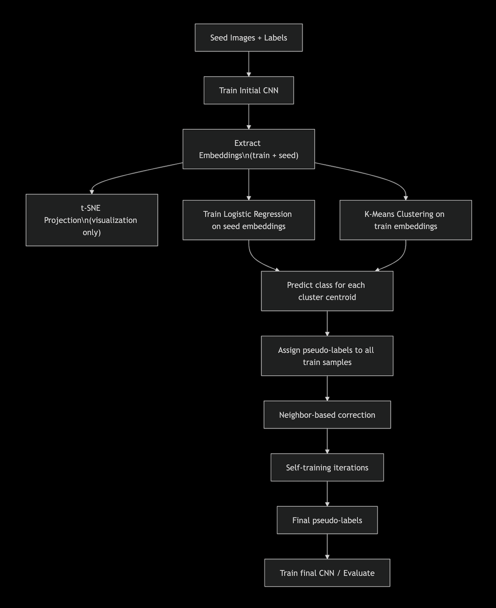

# MNIST bootstraping

This project implements a learning pipeline for the MNIST dataset. It uses the testset as a base to generate pseudo-labels for a large trainset form MNIST database. 

The pipeline combines clustering, classification, neighbour-based correction and self-training to iteratively refine the generated labels for trainset.

## Pipeline overview

The pipeline consists in:

1. Train an initial CNN on labeled `seedset`(MNIST-testset).
2. Extracts the embeddings from the last dense layer.
3. Applies `t-SNE` to visualize a 2D projection of the embeddings.
4. Clusters the unlabeled embeddings using `KMeans`.
5. Trains a Logistic Regression classifier on the seed embeddings.
6. Predicts a digit class for each cluster-centered using `LogisticRegression`.
7. Maps each cluster to a class and assigns a pseudo-labels to `train images`.
8. Corrects labels _via_ `k`-nearest (euclidean) neighboors.
9. Applies self-training to further refine labels using high-confidence predictions.
10. Evalueates the final-pseudo-labels agains the groundtruth (train-labels)

## Exploration phase

The exploration phase was made in a `jupyter-notebook` in branch `exploring` (which is not intended to be merged in `main`). [Here](https://github.com/ebuitragod/mnist_bootstraping/blob/exploring/app/notebooks/exploring.ipynb)

There we explored:
### Data exploration
1. Normalization of datasets.
2. Distribution of `test-images` over `test_labels`.
3. Structure of datapoints (and plot).
4. Robustness of the datapoints _via_ `drop_prob=0.5`. 

### Model exploration
5. Set of parameter of `tensor.keras.models`, and its summary.
6. Set of paramaters of `model.fit` such as `epochs`, `batch_size`, `learning_rate`.
7. Evaluation of `accuracy`, `val_accuracy`, `loss`, 
8. Plotting the performance of Training and validation accuracy.

### Embedding and clustering
9. Use of `tensorflow.keras.Model` to determine the embeddings.
10. Embedding `TSNE` projection to `2D`.
11. Check the clusters, and also by randomization.
12. Evaluation of the clusters with different algorithms:
    - `KMeans`,
    - `SBSCAN`,
    - `Agglomerative`,
    
    Resulting in chosing for `KMeans` after evaluating by `silhouette_score` and `noise`.

### Correction
13. Training the embedding classifierr on the `seedtest`.
14. Predicting clusters for each cluster centroid. 
15. Assign initial pseudo-labels.

Then we implemented most of these steps in `pipeline jupyter-notebook` to continue with [(here)](https://github.com/ebuitragod/mnist_bootstraping/blob/exploring/app/notebooks/pipeline.ipynb):

### Evaluation of different pipelines:
16. Evaluation of classifiers for the cluster:
    - `LogisticRegression`,
    - `RandomForestClassifier`,
    - `SVM (RBF)`,
    - `SVM (linear)`,
    - `k-NN` (k-Neighboors Classifier),
    - `DecisionTreeClassifier`

    Result: `LogisticRegression` was choses as the classifier we will use due to its performance, accuracy and runing time.

17. Assigning initial labels using `LogisticRegression`.

### Error finding and fixing
18. Add correction by k-neighboors with a minimum agreement. 
19. Implemetation of self_training with a number of iterations.
20. Calculating pre-labeling accuracy before and after correction using `train-labels` as _groundtruth_.

From the work made in these two jupyter notebooks we defined the pipeline that will work as in the following:

## Tools and References

### AI-assistance 
This project used `Deepseek-ai` as an `AI`-tool for correctness of classes, types and implementation. 

### Main References

1. Géron, A. (2022). Hands-On Machine Learning with Scikit-Learn, Keras, and TensorFlow: Concepts, Tools, and Techniques to Build Intelligent Systems (3.ª ed.). O'Reilly Media. [(here)](https://github.com/ebuitragod/mnist_bootstraping/blob/exploring/bibliography/Aure%CC%81lien%20Ge%CC%81ron%20-%20Hands-On%20Machine%20Learning%20with%20Scikit-Learn%2C%20Keras%2C%20and%20TensorFlow_%20Concepts%2C%20Tools%2C%20and%20Techniques%20to%20Build%20Intelligent%20Systems-O'Reilly%20Media%20(2022)%20(1).pdf)

with its repository in Github [(here)](https://github.com/ageron/handson-ml3)

2. Raschka, S. y Mirjalili, V. (2019). Python Machine Learning: Machine Learning and Deep Learning with Python, scikit-learn, and TensorFlow 2 (3.ª ed.). Packt Publishing. [(here)](https://github.com/ebuitragod/mnist_bootstraping/blob/exploring/bibliography/Sebastian%20Raschka%20Python%20Machine%20Learning%20Machine%20Learning%20and%20Deep%20Learning%20with%20Python%2C%20scikit-learn%2C%20and%20TensorFlow%202-Packt%20(2019).pdf)

